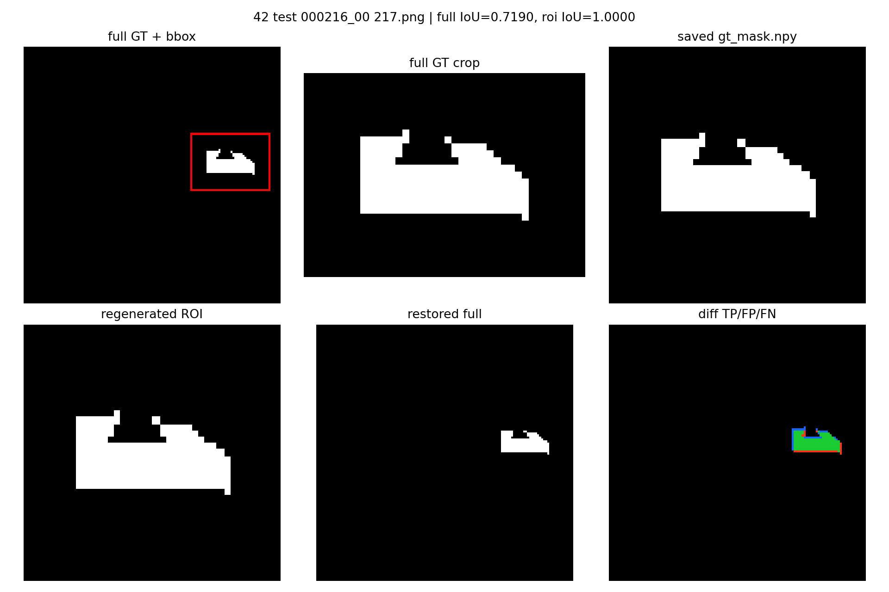
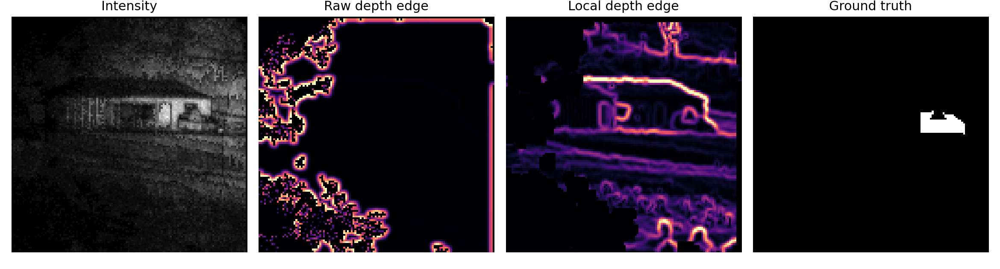
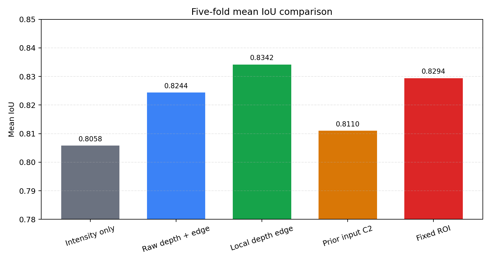

# 近一周实验进展汇报

## 1. 从双阶段 ROI 开始

最开始考虑使用双阶段框架，主要原因是目标像素占比较小，原始深度图中又存在明显的黑边和强伪边缘。目标附近真正有用的深度边缘在全局范围内不够突出，因此计划先用 intensity-only 的 Stage1 定位目标，再将 ROI 送入 Stage2 进行精细分割。

早期方案会将不同大小的 ROI 统一 resize 到 128x128，预测后再还原到原图。后来使用 oracle GT ROI 做了理论上限检查，发现即使不经过模型预测，只将 GT ROI resize 后再还原，平均 IoU 也只有约 0.7645。

下面是其中一个样本的诊断结果。ROI 保存前后的内容是一致的，但重新还原到原图后产生了明显的边界偏移和像素损失。这说明早期双阶段效果不理想，不完全是 Stage2 模型的问题，resize/restore 本身已经降低了理论上限。

## 2. 尝试取消 resize

为避免几何损失，后续将 Stage2 改为全图尺度 refinement，并尝试了以下方式：

- 将 Stage1 prob、coarse mask 和 ROI mask 作为 Stage2 输入；
- 使用 `final_logits = stage1_logits + delta_logits` 的残差精修；
- 将 residual 输出层零初始化；
- 只允许 Stage2 在 ROI 内修改；
- 提高 Stage1 错误像素的 loss 权重。

这些实验中，普通 gated residual 的平均 IoU 约为 0.8072，而 intensity-only Stage1 为 0.8058，提升只有约 0.0014，基本可以认为持平。错误像素加权版本下降到约 0.7998，主要原因是 Stage2 修复部分错误的同时，也破坏了更多原本正确的像素。

之后直接把 Stage1 prob 和 ROI mask 与新特征拼接，网络又容易优先复制 Stage1 输出。验证集 IoU 从第一个 epoch 开始就基本不变，说明模型形成了明显的先验捷径，没有充分利用 depth edge。

## 3. 重新检查 depth 和 edge 是否有效

由于多种 Stage2 方案都没有稳定提升，一度怀疑 depth 和 edge 是否真的能提供额外信息。进一步观察发现，问题主要不是 depth 无效，而是原始 depth edge 的动态范围被黑边和无效区域产生的强边缘占据。

因此重新从 depth 构造了 local depth edge：

- 使用有效深度中位数临时填充无效区域；
- 经过 Gaussian 平滑后计算 Sobel 梯度；
- 腐蚀有效区域，屏蔽黑边附近的伪边缘；
- 使用 ROI/有效区域内的 99 分位进行鲁棒归一化。

下面是同一帧的对比。原始 depth edge 中黑边响应非常强，而 local depth edge 能够抑制黑边，并重新突出有效区域内的结构边缘。

将该特征用于单阶段模型后，结果明显提升：

- intensity-only：Mean IoU 0.8058；
- intensity + 原始 depth + depth edge：Mean IoU 0.8244；
- intensity + local depth edge：Mean IoU 0.8342；
- 同配置复现实验 C1：Mean IoU 约 0.8364。

这说明 depth 和 edge 确实能够提供有效信息，关键在于如何根据单光子激光雷达的成像特点处理黑边和局部边缘，而不是简单增加输入通道。

## 4. 再次验证双阶段是否必要

在确认 local depth edge 有效后，又尝试将 Stage1 先验加入模型：

- C2：`intensity + local depth edge + prob + ROI mask`；
- C3：进一步加入 `local depth edge x ROI mask`。

两组平均 IoU 都只有约 0.8110，明显低于不使用 Stage1 prior 的 C1。主要原因仍是模型过度依赖 prob，直接学习 Stage1 的输出，而没有继续利用 local depth edge。

随后采用固定 80x80 ROI，只进行 crop/pad，不再 resize，并在 ROI 内重新计算和归一化 local depth edge。五折 test GT 覆盖率接近 100%，平均 IoU 为 0.8294。该结果高于 intensity-only，但仍低于全图 local depth edge 模型，说明固定 ROI 虽然解决了几何损失，但也可能损失部分全局上下文。

目前主要方案的结果对比如下：

## 5. 当前判断与后续计划

目前可以确认，针对黑边伪响应重新构造 local depth edge 是有效的，也是近一周最稳定的改进。现阶段还没有证据表明双阶段框架明显优于强单阶段模型：

- ROI resize 会引入较大的几何损失；
- 全图 residual refinement 基本只能与 Stage1 持平；
- 直接加入 Stage1 prob 容易产生捷径学习；
- 固定尺寸 ROI 虽然避免了 resize，但没有超过全图 local depth edge。

因此，双阶段在当前任务中可能没有太大必要。后续计划是以 `intensity + local depth edge` 作为主要基线，进一步分析不同距离、信噪比和目标大小下的表现。同时可以尝试两个独立模型的后融合，让 intensity-only 模型和 local-edge 模型分别训练，再在验证集上搜索融合权重，避免在训练过程中直接依赖 Stage1 prior。

如果后融合仍没有稳定提升，后续将弱化或放弃双阶段结构，把主要工作集中在单光子激光雷达远距离弱目标条件下的深度伪边缘抑制和强度-深度边缘融合。
